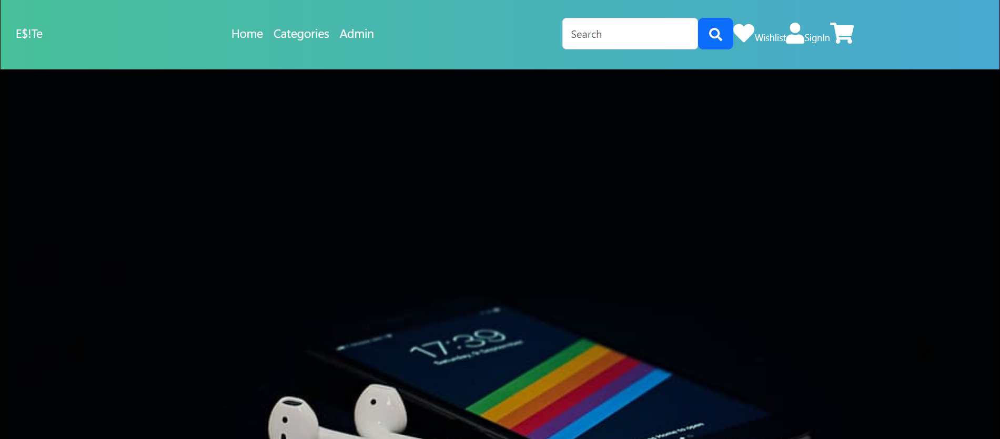
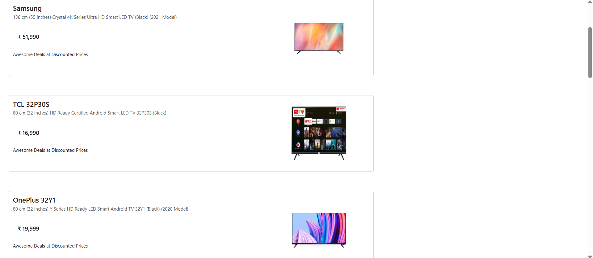

# Full Stack Web Application

An end-to-end e-commerce website built with React.js frontend and Node.js/Express backend with MongoDB database.

## � Screenshots

### Homepage


### Product Catalog - Televisions Category


### Order Summary


## 📝 Features

- **User Authentication**
  - Register new account
  - Login/Logout
  - Password reset via email
  - JWT-based authentication
  - Protected routes

- **Product Catalog**
  - Browse products by categories
  - Search and filter products
  - Detailed product views
  - Product ratings and reviews

- **Shopping Experience**
  - Add to cart functionality
  - Wishlist management
  - Real-time cart updates
  - Checkout process

- **Payment Integration**
  - Stripe payment gateway
  - Secure payment processing
  - Order confirmation

- **Admin Panel**
  - Product Management (CRUD operations)
  - User Management
  - View and manage orders
  - Dashboard analytics

- **Additional Features**
  - Responsive design with Bootstrap
  - Error boundaries for better UX
  - Form validation
  - Loading states and feedback

## 🧪 Testing

The project includes Jest tests for React components.

**Run tests:**
```bash
cd frontend_React
npm test
```

## 📜 Available Scripts

### Backend (`backend_MongoDB`)

- `npm start` - Start the backend server with nodemon (auto-restart on changes)
- `npm run dev` - Start the backend without nodemon
- `npm run seed` - Seed the database with initial product data
- `npm run lint` - Run ESLint to check code quality

### Frontend (`frontend_React`)

- `npm start` - Start the development server with webpack-dev-server
- `npm run build` - Build the production-ready bundle
- `npm test` - Run Jest tests

## 🗄️ Database Schema

The application uses MongoDB with the following main collections:

- **Products** - Product information (name, price, category, images, etc.)
- **Users** - User accounts and authentication
- **Cart** - Shopping cart items
- **Wishlist** - User wishlists
- **Orders** - Order history and details

## 📝 Features

## 🌐 URLs

- **Frontend:** http://localhost:4400
- **Backend API:** http://localhost:8081
- **API Routes:** http://localhost:8081/api
- **MongoDB:** mongodb://localhost:27017/ProductsAPI

## 🔑 API Endpoints

### Public Routes
- `POST /api/users/register` - Register new user
- `POST /api/users/login` - User login
- `POST /api/users/forgot-password` - Request password reset
- `POST /api/users/reset-password` - Reset password
- `GET /api/products` - Get all products
- `GET /api/products/:id` - Get product by ID

### Protected Routes (Requires Authentication)
- `GET /api/users/profile` - Get user profile
- `PUT /api/users/profile` - Update user profile
- `GET /api/cart` - Get user's cart
- `POST /api/cart` - Add item to cart
- `PUT /api/cart/:id` - Update cart item
- `DELETE /api/cart/:id` - Remove item from cart
- `GET /api/wishlist` - Get user's wishlist
- `POST /api/wishlist` - Add item to wishlist
- `DELETE /api/wishlist/:id` - Remove from wishlist

### Admin Routes (Requires Admin Role)
- `POST /api/products` - Create new product
- `PUT /api/products/:id` - Update product
- `DELETE /api/products/:id` - Delete product
- `GET /api/users` - Get all users
- `PUT /api/users/:id` - Update user
- `DELETE /api/users/:id` - Delete user

## 📦 Installation

### Prerequisites

Before you begin, ensure you have the following installed:
- **Node.js** (v14 or higher) - [Download](https://nodejs.org/)
- **MongoDB** (v4 or higher) - [Download](https://www.mongodb.com/try/download/community)
- **Git** - [Download](https://git-scm.com/)

### Step 1: Clone the Repository

```bash
git clone <repository-url>
cd Full_stack_web_application
```

### Step 2: Install Dependencies

**Backend Dependencies:**
```bash
cd backend_MongoDB
npm install
```

**Frontend Dependencies:**
```bash
cd ..\frontend_React
npm install
```

### Step 3: Configure Environment Variables

1. Navigate to the backend folder:
   ```bash
   cd ..\backend_MongoDB
   ```

2. Create a `.env` file by copying the example:
   ```bash
   copy .env.example .env
   ```

3. Edit the `.env` file with your configuration:
   ```env
   # Stripe API Keys (Get from: https://dashboard.stripe.com/apikeys)
   STRIPE_SECRET_KEY=sk_test_your_actual_stripe_key_here

   # MongoDB Connection
   MONGODB_URI=mongodb://localhost:27017/ProductsAPI

   # Server Port
   PORT=8081
   ```

### Step 4: Start MongoDB

Ensure MongoDB is running on your system:

```cmd
net start MongoDB
```

If MongoDB is not installed as a service, start it manually:
```cmd
mongod
```

### Step 5: Seed the Database (First Time Only)

Populate the database with initial product data:

```bash
cd backend_MongoDB
npm run seed
```

You should see a success message indicating products were added to the database.

### Step 6: Start the Application

**Terminal 1 - Backend:**
```bash
cd backend_MongoDB
npm start
```
Backend will run on: http://localhost:8081

**Terminal 2 - Frontend:**
```bash
cd frontend_React
npm start
```
Frontend will run on: http://localhost:4400

### Step 7: Access the Application

Open your browser and navigate to:
- **Frontend:** http://localhost:4400
- **Backend API:** http://localhost:8081/api
